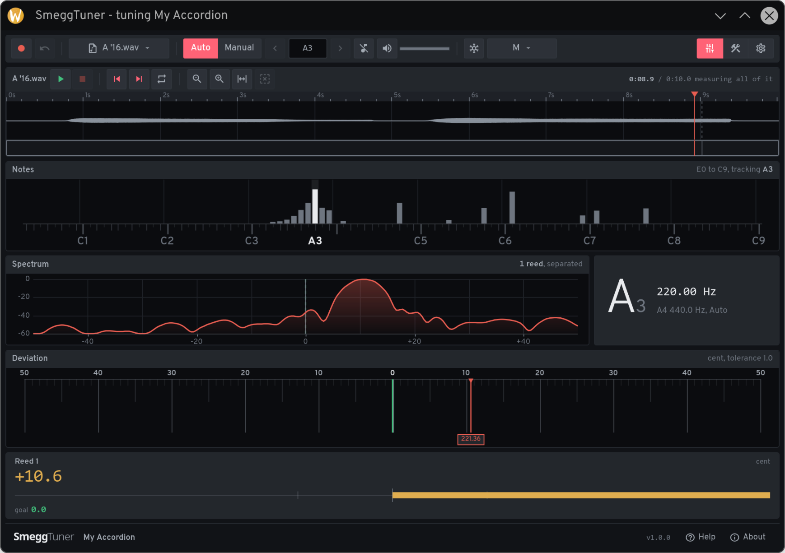
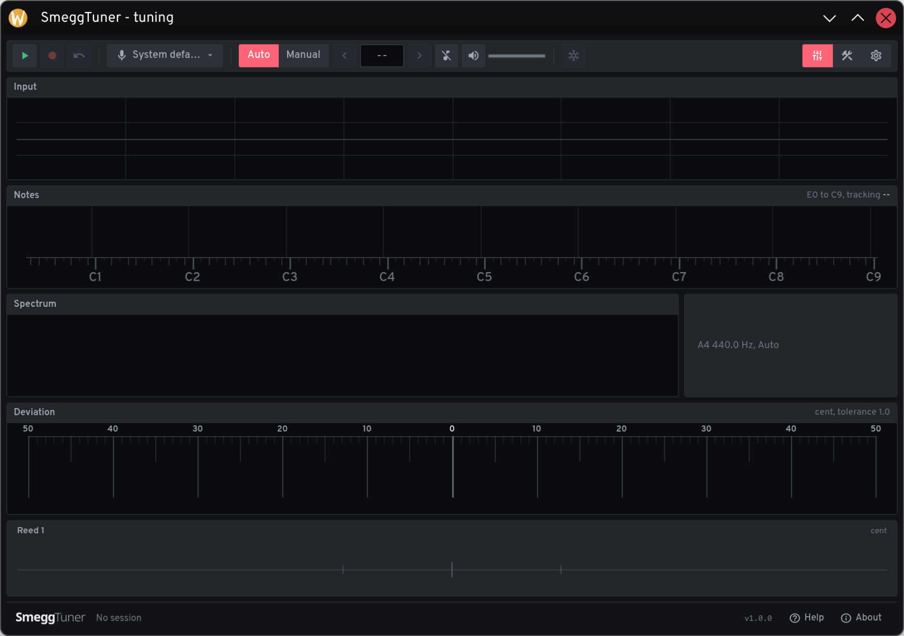
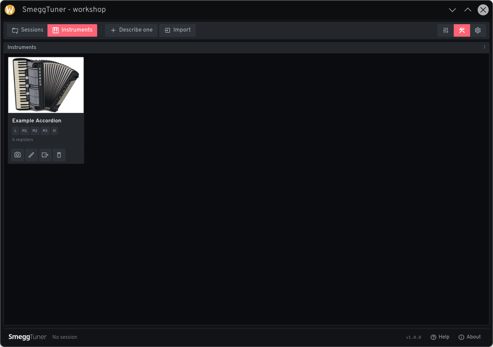
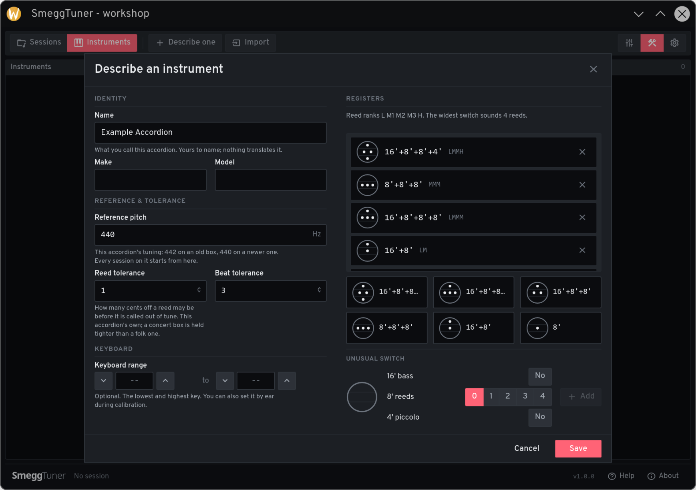
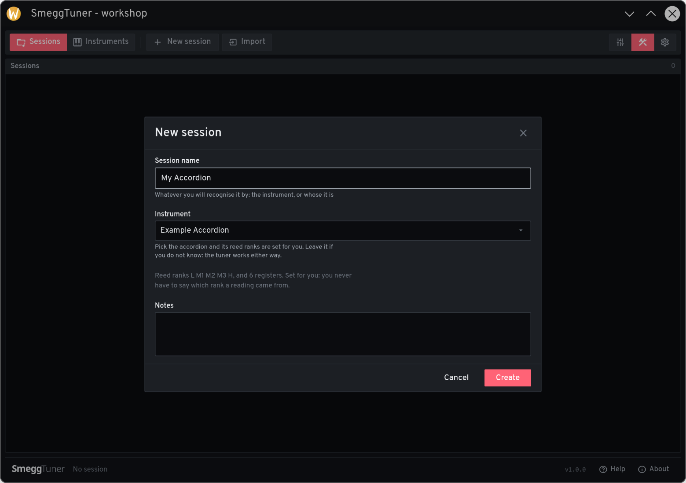
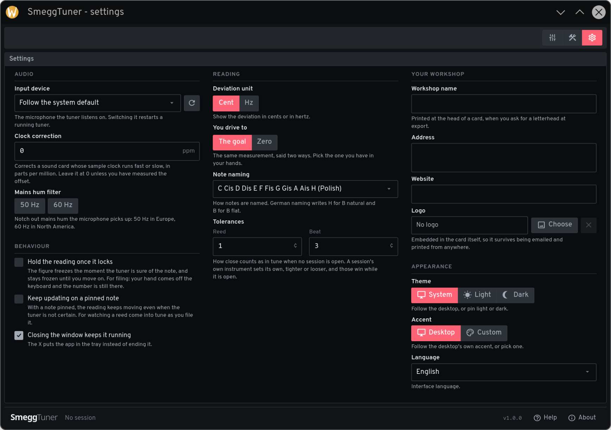

<p align="center">
  
</p>

SmeggTuner is a desktop tuner for accordions, a free reimplementation of Dirk's professional Accordion Tuner. It listens to a whole register at once, tells the reeds of a musette apart, and shows how far each one is from where it should be.

Built with Go, Wails 3, and Nuxt (Vue 3).

## What It Does

- Pull a register and every reed under it is measured at once, on a -50 to +50 cent ruler with a needle and frequency per reed.
- Reeds too close for the spectrum to separate are pulled apart through the beat between them, down to 0.6 Hz.
- The target is a goal curve you choose: none, anchors you type, or a curve fitted to readings you recorded.
- Sessions and the instrument library live in a local SQLite database; a session exports as a `.stsf` file and an instrument as a `.stif` (both plain zips).
- Reference recordings can be analysed from a WAV, so it works without an accordion on the desk.
- System tray integration; English and Polish.

A session is one accordion and one set of readings, one per voice, replaced when you play the note again. Checking a note without opening a session creates nothing.

## Status

Work in progress. It is usable on a real bench and the detection is genuine, but not yet the equal of Dirk's professional Accordion Tuner, the tool it reimplements. Known-hard cases: three reeds crowded into one blob (the beat method separates a close pair, not a trio) and 16-foot registers where one reed's harmonic lands on another.

## Prerequisites

Linux only for now. Windows is untested but close, since the audio layer is `malgo`.

- Go 1.26+ (with CGO enabled)
- Node.js + pnpm
- C compiler (gcc or clang), pkg-config
- GTK 3 dev headers (`libgtk-3-dev` on Debian/Ubuntu, `gtk3-devel` on Fedora)
- WebKit2GTK 4.1 dev headers (`libwebkit2gtk-4.1-dev`, `webkit2gtk4.1-devel`)
- Wails 3 CLI, pinned to the alpha this app uses: `go install github.com/wailsapp/wails/v3/cmd/wails3@v3.0.0-alpha2.117`
- Just (a Taskfile is there too)

## Setup

```sh
git clone https://github.com/smegg99/Smegg-s-professional-Accordion-Tuner
cd Smegg-s-professional-Accordion-Tuner
cd frontend && pnpm install && cd ..
just dev
```

`config.json` is generated from the CUE schema on first run.

## Development

```sh
just dev            # full app, hot reload
just dev-frontend   # Nuxt only (renders without the Go backend)
just build          # production build -> bin/
just test           # Go suite, race detector
just lint           # frontend
```

## Screenshots

<div align="center">
  <table>
    <tr>
      <td align="center" style="padding-bottom: 20px;">
        <br>
        <em>Analysing a recording: the note, its spectrum, and each reed on the cent ruler.</em>
      </td>
      <td align="center" style="padding-bottom: 20px;">
        <br>
        <em>The tune view, live off the microphone, waiting for a note.</em>
      </td>
    </tr>
    <tr>
      <td align="center" style="padding-bottom: 20px;">
        <br>
        <em>The workshop and its instrument library.</em>
      </td>
      <td align="center" style="padding-bottom: 20px;">
        <br>
        <em>Describing an accordion, its registers built from the switch symbols.</em>
      </td>
    </tr>
    <tr>
      <td align="center">
        <br>
        <em>Starting a session on a described instrument.</em>
      </td>
      <td align="center">
        <br>
        <em>Settings: audio, reading, workshop letterhead, and appearance.</em>
      </td>
    </tr>
  </table>
</div>

## License

See [LICENSE](LICENSE).
